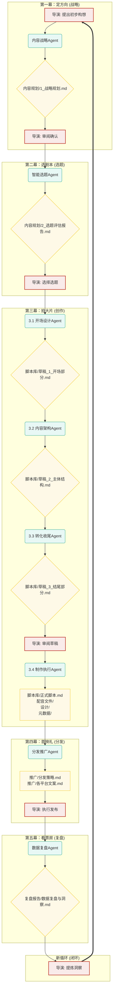

<h3 align="center">新内容创作Agent协作流程图</h3>

```mermaid
graph TD;
    subgraph "第一幕：定方向 (战略)"
        A[导演: 提出初步构想] --> B(内容战略Agent);
        B --> C{"内容规划/1_战略规划.md"};
        C --> D[导演: 审阅确认];
    end

    subgraph "第二幕：选剧本 (选题)"
        D --> E(智能选题Agent);
        E --> F{"内容规划/2_选题评估报告.md"};
        F --> G[导演: 选择选题];
    end

    subgraph "第三幕：拍大片 (创作)"
        G --> H(3.1 开场设计Agent);
        H --> I{"脚本库/草稿_1_开场部分.md"};
        I --> J(3.2 内容架构Agent);
        J --> K{"脚本库/草稿_2_主体结构.md"};
        K --> L(3.3 转化收尾Agent);
        L --> M{"脚本库/草稿_3_结尾部分.md"};
        M --> N[导演: 审阅草稿];
        N --> O(3.4 制作执行Agent);
        O --> P["脚本库/正式脚本.md<br/>配音文件/<br/>设计/<br/>元数据/"];
    end

    subgraph "第四幕：首映礼 (分发)"
        P --> Q(分发推广Agent);
        Q --> R["推广/分发策略.md<br/>推广/各平台文案.md"];
        R --> S[导演: 执行发布];
    end

    subgraph "第五幕：看票房 (复盘)"
        S --> T(数据复盘Agent);
        T --> U{"复盘报告/数据复盘与洞察.md"};
    end
    
    subgraph "新循环 (闭环)"
        U --> V[导演: 提炼洞察];
        V ==> A;
    end

    style A fill:#F9EBEA,stroke:#C0392B,stroke-width:2px
    style D fill:#F9EBEA,stroke:#C0392B,stroke-width:2px
    style G fill:#F9EBEA,stroke:#C0392B,stroke-width:2px
    style N fill:#F9EBEA,stroke:#C0392B,stroke-width:2px
    style S fill:#F9EBEA,stroke:#C0392B,stroke-width:2px
    style V fill:#F9EBEA,stroke:#C0392B,stroke-width:2px
    
    style B fill:#E8F8F5,stroke:#16A085,stroke-width:1px
    style E fill:#E8F8F5,stroke:#16A085,stroke-width:1px
    style H fill:#E8F8F5,stroke:#16A085,stroke-width:1px
    style J fill:#E8F8F5,stroke:#16A085,stroke-width:1px
    style L fill:#E8F8F5,stroke:#16A085,stroke-width:1px
    style O fill:#E8F8F5,stroke:#16A085,stroke-width:1px
    style Q fill:#E8F8F5,stroke:#16A085,stroke-width:1px
    style T fill:#E8F8F5,stroke:#16A085,stroke-width:1px

    style C fill:#FEF9E7,stroke:#F1C40F,stroke-width:1px
    style F fill:#FEF9E7,stroke:#F1C40F,stroke-width:1px
    style I fill:#FEF9E7,stroke:#F1C40F,stroke-width:1px
    style K fill:#FEF9E7,stroke:#F1C40F,stroke-width:1px
    style M fill:#FEF9E7,stroke:#F1C40F,stroke-width:1px
    style P fill:#FEF9E7,stroke:#F1C40F,stroke-width:1px
    style R fill:#FEF9E7,stroke:#F1C40F,stroke-width:1px
    style U fill:#FEF9E7,stroke:#F1C40F,stroke-width:1px
```