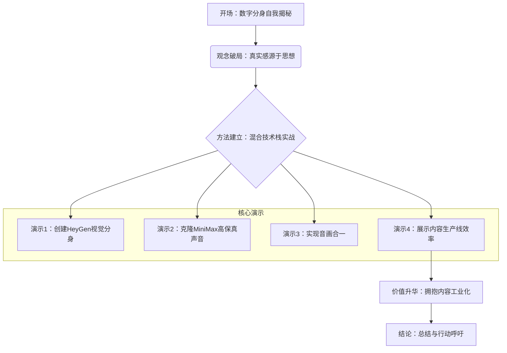

# 视频结构设计：用 HeyGen 生成数字分身

## 1. 开场策略建议 (已根据“全程数字分身”调整)

### 1.1 策略一 (推荐): 自我揭秘，建立技术权威
- **思路**: 直接用高质量的数字分身开场，然后由分身自己“揭秘”其混合身份，通过前后效果的强烈对比，颠覆观众对数字人“塑料感”的刻板印象，迅速建立视频的技术价值和可信度。
- **具体实现建议**:
    - 视频开篇，直接播放一段由“混合技术栈”生成的、效果极佳的数字分身视频片段，内容是本期视频核心观点的浓缩。
    - 播放完毕，数字分身继续说：“如果我告诉你，你刚才听到的声音，和现在看到的我，其实来自两个不同的AI模型。只用一个模型的效果，是这样的...”，然后立即播放同一段话，但使用HeyGen自带的、有明显“塑料感”的中文声音。
    - 效果对比后，数字分身继续（用高质量声音）说：“数字分身的真实感，瓶颈往往不在视觉，而在听觉。今天，我将带你了解我是如何被创造出来的，以及这套‘混合技术栈’打法，将如何改变内容创作的生产力规则。”

## 2. 整体叙事结构与节奏

### 2.1 概述
沿用经典的 **“破（打破疑虑） -> 立（建立方法） -> 升华（提升价值）”** 的三段式结构。
- **开场 (1-2分钟)**: 使用推荐的“自我揭秘”策略，用效果对比制造冲击，引出核心议题。
- **第一部分：观念破局 (3-4分钟)**: 由数字分身论证其核心价值在于解放思想，直面“缺乏真实感”的普遍质疑。
- **第二部分：方法建立 (8-10分钟)**: 核心演示部分。由数字分身作为“讲师”，分步实操，展示如何使用“HeyGen + MiniMax”混合技术栈进行创造。
- **第三部分：价值升华 (2-3分钟)**: 论证这是一个“内容工业化”的必然趋势，并以“效率对比”的震撼演示收尾，强化观点。
- **结论 (1-2分钟)**: 总结核心方法，并发出行动呼吁。

### 2.2 结构流程图 (Mermaid)

## 3. 论点与演示设计详述

### 3.1 论点1: 观念破局 - 真实感源于思想，而非物理呈现
- **3.1.1 核心阐述要点**:
    - (由数字分身讲述) 直接回应观众内心最大的疑虑：数字人没有“灵魂”。
    - 提出核心论点：对于知识类创作者，观众消费的是创作者的“思想”，而非其“物理在场”。观点、逻辑、洞察力才是核心资产。
    - 类比：写文章、写代码，我们接受用键盘而不是手写，因为工具效率更高。我，作为数字分身，也是同样的逻辑，是一个更高效的“思想输出工具”。
    - 结论：我们要追求的是“思想的真实”，而不是“物理的真实”。

### 3.2 论点2: 方法建立 - “混合技术栈”实战

- **3.2.1 [关联演示点 1]: 高质量视觉分身创建 (HeyGen)**
    - **演示目标**: 掌握在HeyGen中创建高质量数字分身的关键技巧，避免常见错误。
    - **内容概要**: 从讲解录制规范开始，完整走一遍HeyGen数字人的创建流程。
    - **理想操作步骤**:
        - **步骤 1: 讲解训练素材录制规范**
            - *操作*: 数字分身出现在屏幕一侧进行讲解，主屏幕播放一段**符合规范的、预先录制好的真人演示视频**作为素材示例。
            - *预期屏幕状态*: 画面分屏或画中画。主画面为真人录制视频，并用文字图层标注要点：眼神直视镜头、面部光线均匀、背景干净、不要有太多手部动作、匀速说出一段2分钟左右的稿件。
            - *潜在提示*: 数字分身强调“眼神接触”是训练出高质量分身的关键，并可以展示一个用“眼神乱飘”的素材训练出的失败分身案例作为对比。
        - **步骤 2: 上传素材并创建分身**
            - *操作*: 切换到HeyGen界面的屏幕录制，数字分身进行旁白解说，操作上传刚刚作为示例的标准视频素材。
            - *预期屏幕状态*: 屏幕显示HeyGen的上传进度条和处理界面。
            - *潜在提示*: 数字分身提醒观众，根据平台处理速度，这个过程可能需要一些时间，可以跳过等待。
        - **步骤 3: 预览与命名**
            - *操作*: 展示分身创建完成后的预览界面，在数字分身的解说下，给新分身起一个有意义的名字。
            - *预期屏幕状态*: 屏幕上出现可用的、新的数字分身形象。

- **3.2.2 [关联演示点 2]: 高保真声音克隆 (MiniMax)**
    - **演示目标**: 展示如何用MiniMax克隆出比HeyGen自带声音更真实、更富感情的中文声音。
    - **内容概要**: 实操MiniMax声音克隆，并与HeyGen自带的声音进行AB对比。
    - **理想操作步骤**:
        - **步骤 1: 演示HeyGen自带声音的局限性**
            - *操作*: (此步骤已在开场策略中完成，此处可以快速回顾或跳过) 在HeyGen中，使用刚创建的数字分身，输入一段中文，使用平台自带的声音克隆功能生成视频。
            - *预期屏幕状态*: 播放生成的视频，观众能明显听到“塑料味”的中文发音。
        - **步骤 2: 录制并上传MiniMax训练音频**
            - *操作*: 切换到MiniMax声音克隆界面的屏幕录制，数字分身旁白解说，引导如何录制或上传一小段（例如1分钟）的中文干声音频。
            - *预期屏幕状态*: MiniMax的录制或上传界面。
            - *潜在提示*: 数字分身强调训练音频的质量至关重要：环境要安静，不要有回音，使用较好的麦克风。
        - **步骤 3: 生成并试听克隆声音**
            - *操作*: 在MiniMax中输入相同的中文文本，生成音频并播放。
            - *预期屏幕状态*: 播放生成的音频，与步骤1的音频形成鲜明对比，凸显其自然度和保真度。下载该音频文件。

- **3.2.3 [关联演示点 3]: “音画合一”视频生成**
    - **演示目标**: 完成混合技术栈的闭环，将高质量的音频与视觉分身结合。
    - **内容概要**: 将MiniMax生成的音频上传到HeyGen，与数字分身合并。
    - **理想操作步骤**:
        - **步骤 1: 上传外部音频**
            - *操作*: 回到HeyGen视频创建界面的屏幕录制，数字分身旁白解说，选择“音频上传”功能。
            - *预期屏幕状态*: HeyGen界面，光标点击上传按钮。
        - **步骤 2: 选择MiniMax音频文件**
            - *操作*: 在文件选择器中，选择刚刚从MiniMax下载的音频文件。
            - *预期屏幕状态*: 文件被上传，并出现在HeyGen的音频轨道上。
        - **步骤 3: 生成并预览最终视频**
            - *操作*: 点击“生成视频”按钮。
            - *预期屏幕状态*: 播放最终生成的视频片段。此时，画面是HeyGen的，声音是MiniMax的，效果高度逼真。

- **3.2.4 [关联演示点 4]: 内容生产线效率展示**
    - **演示目标**: 直观展示“数字分身工作流”相对于“传统录制流程”的巨大效率优势。
    - **内容概要**: 并排对比两种模式完成同一个短视频所需的时间和精力。
    - **理想操作步骤**:
        - **步骤 1: “传统模式”模拟**
            - *操作*: 屏幕左侧，播放一段模拟“传统录制流程”的视频片段，展示创作者真人录制时可能遇到的各种问题（如调整灯光、NG等）。
            - *预期屏幕状态*: 画面左侧播放这段“手忙脚乱”的录制过程，右上角用秒表计时，时间不断跳动。数字分身在画外音中解说痛点。
        - **步骤 2: “AI模式”演示**
            - *操作*: 画面切换到屏幕录制，展示只需打开文本编辑器，将脚本粘贴到HeyGen，上传准备好的音频，点击生成。
            - *预期屏幕状态*: 画面右侧播放这个“行云流水”的操作过程，右上角同样用秒表计时。数字分身在画外音中解说其高效性。
        - **步骤 3: 结果对比**
            - *操作*: 最终定格画面，左侧显示传统模式耗时（例如：15分钟），右侧显示AI模式耗时（例如：1分钟），形成巨大视觉冲击。

## 4. 结论部分设计

- **4.1 核心观点回顾与总结要点**:
    - (由数字分身讲述) 再次强调核心观点：我，作为数字分身，不是捷径，而是“内容创作工业化”的引擎。
    - 总结“HeyGen+MiniMax”混合技术栈的优势：视觉真实感 + 听觉保真度 = 高质量成品。
    - 呼应开头的痛点：这套工作流将创作者从重复的“表演”中解放，回归思想创作的核心价值。
- **4.2 行动呼吁或延伸思考建议**:
    - 鼓励知识类创作者，特别是那些因镜头恐惧或时间限制而犹豫不决的专家，去尝试这项技术。
    - 提出一个思考题：“当你拥有了一支像我一样，不知疲倦、无限复用的‘数字分身团队’后，你的内容创作可以达到怎样新的高度？”
    - 引导观众在评论区分享他们对数字分身的看法，或者他们希望用这项技术来创作什么内容。 