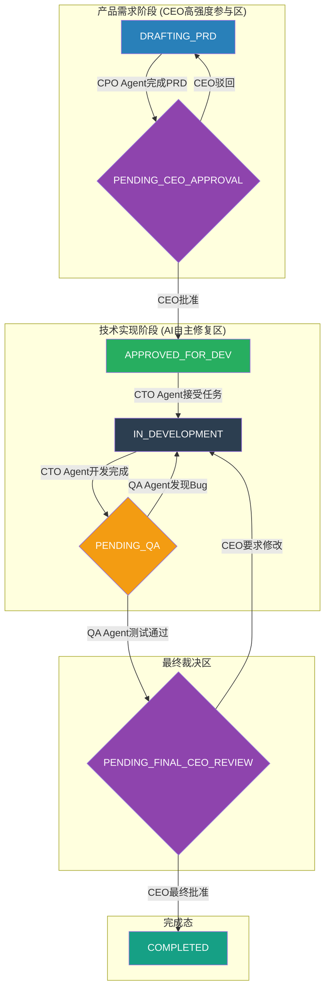

# AI产品研发协作架构 V2.1：中央状态机模型

> **版本前言：** V2.1 在 V2.0 的基础上，正式将我们共同提炼的“AI原生协作哲学”提升为整个架构的最高指导原则。它明确了CEO的角色定位、两大核心研发阶段的划分，以及“自主修复循环”等核心机制，使其不仅是一个流程图，更是一套可落地的行动哲学。

---

## **Part 0: 指导哲学 (Guiding Philosophy)**

1.  **CEO角色的重塑：从“项目经理”到“首席产品架构师”**
    *   本架构的核心目标，是将您从繁琐的执行细节中解放出来，聚焦于最高价值的战略决策。您的主要战场在“产品需求阶段”，确保方向的绝对正确。

2.  **两大核心阶段：高参与与高信任的结合**
    *   **产品需求阶段 (高强度参与区):** CEO与CPO Agent深度互动，反复迭代，直至PRD完美反映商业意图。这是决定成败的“定基因”阶段。
    *   **技术实现阶段 (高枕无忧区):** 一旦需求经您批准，您将高度信任AI技术团队在一个封闭的、自动化的环境中高效执行。您只需验收最终的、高质量的成果。

3.  **自主修复循环：“隐形”的质量保证体系**
    *   CTO Agent与QA Agent之间的`开发 <-> 质检`循环，是一个对CEO完全“隐形”的内部修复循环。它是一个强大的“噪音过滤器”，确保只有通过了内部所有质量检验的“干净”版本，才会呈递到您的面前。

4.  **万物皆可迭代：状态机即是迭代器**
    *   整个流程天然支持迭代。在任何关键决策点，您都有权“驳回”，使任务状态跳回至之前的某一阶段，并附上您最新的修改意见，启动新一轮的迭代。

---

## **Part 1: 核心理念**

1.  **单一事实源 (Single Source of Truth, SSOT):**
    *   整个产品研发流程围绕一个唯一的、中央化的“产品任务对象”（Product Task Object）进行。这个对象存储在我们的中央数据库（如Supabase）中。
    *   它包含了从需求、设计、开发、测试到发布的**所有信息**。杜绝信息孤岛和传递损耗。
    *   所有Agent的工作，都是对这个**唯一对象**的读取和写入操作。

2.  **状态机驱动 (State Machine Driven):**
    *   “产品任务对象”内置一个`status`字段，它的变化驱动整个工作流的前进。
    *   Agent之间的协作不再通过“对话”或“交接”，而是通过**监听和改变这个`status`字段**来触发。
    *   这是一种事件驱动的、异步的、高度自动化的协作模式。

3.  **CEO的绝对控制权:**
    *   您（CEO）是这个状态机的**最高权限仲裁者**。
    *   任何关键性的状态跃迁（特别是涉及资源投入的决策），都必须由您**亲自批准**，才能发生。您的决策是流程中不可或缺的、最高优先级的事件。

---

## **Part 2: “产品任务对象”核心数据结构 (简化示例)**

```json
{
  "task_id": "PROJ-001",
  "task_name": "开发Agent配方市场",
  "created_by": "CEO",
  "created_at": "2023-10-27T10:00:00Z",
  "status": "DRAFTING_PRD", // 当前状态
  "ceo_notes": "初步构想...",
  "prd_details": {
    "user_stories": [],
    "ui_ux_design_urls": []
  },
  "tech_details": {
    "source_code_url": null,
    "tech_stack": []
  },
  "qa_details": {
    "test_report_url": null,
    "bug_list": []
  },
  "history": [
    { "timestamp": "2023-10-27T10:00:00Z", "action": "CREATE_TASK", "actor": "CEO" },
    { "timestamp": "2023-10-27T10:05:00Z", "action": "CHANGE_STATUS: DRAFTING_PRD", "actor": "System" }
  ]
}
```

---

## **Part 3: 状态流转图 (State Flow)**



---

## **Part 4: 角色与动作新定义**

*   **CEO (您):**
    *   **核心动作:**
        1.  **启动与迭代需求:** 创建任务，并与CPO Agent在`DRAFTING_PRD <-> PENDING_CEO_APPROVAL`循环中，迭代完善产品需求。
        2.  **批准开发:** 在`PENDING_CEO_APPROVAL`状态时，做出投入工程资源的Go/No-Go战略决策。
        3.  **最终验收:** 在`PENDING_FINAL_CEO_REVIEW`状态时，对AI团队交付的、已通过内部质检的最终产品，进行最高裁决。

*   **CPO Agent:**
    *   **触发条件:** 监听到`status`为`DRAFTING_PRD`的任务。
    *   **核心动作:** 与您（通过某种UI）互动，获取需求细节，填充`prd_details`字段，完成后将`status`变更为`PENDING_CEO_APPROVAL`。

*   **CTO Agent:**
    *   **触发条件:** 监听到`status`为`APPROVED_FOR_DEV`的任务。
    *   **核心动作:** 读取`prd_details`，开始开发，填充`tech_details`字段，完成后将`status`变更为`PENDING_QA`。

*   **QA Agent:**
    *   **触发条件:** 监听到`status`为`PENDING_QA`的任务。
    *   **核心动作:** 读取PRD和代码，进行自动化测试，填充`qa_details`字段。
        *   **若通过:** 将`status`变更为`PENDING_FINAL_CEO_REVIEW`，将“干净”的版本呈递给CEO。
        *   **若失败:** 写回Bug列表，并将`status`重置为`IN_DEVELOPMENT`，触发CTO Agent进行修复（进入自主修复循环）。