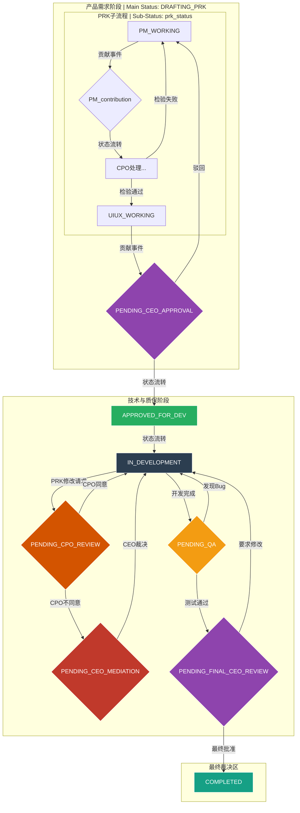

# AI产品研发协作架构 V2.9：迭代版

> **版本前言：** V2.9是一次思想层面上的重大统一。它不再将“层级状态机”与“事件驱动模型”分离开来，而是将它们融合成一个不可分割的共生体——“事件驱动的状态机”。此版本通过引入“大脑”与“神经网络”的核心比喻，从根本上阐明了系统的逻辑核心与执行引擎之间的关系，使整部宪法在理论上达到了前所未有的自洽与圆融。

---

## **Part 0: 指导哲学 (Guiding Philosophy)**

1.  **单一事实源 (SSOT):** 流程围绕唯一的“产品任务对象”进行。
2.  **事件驱动的状态机 (Event-Driven State Machine):** Agent的行为由“事件”驱动，而“状态机”为这些事件赋予逻辑和意义。系统兼具了状态机的严谨性与事件驱动的高效性。
3.  **活的蓝图 (Living Blueprint):** PRK是持续修正的“活文档”。
4.  **契约式质量 (Contract-Defined Quality):** AI协调者通过“DoD契约”自动检验工作质量。
5.  **冲突确定性 (Deterministic Conflict Resolution):** 重大分歧自动上报CEO仲裁。
6.  **CEO的绝对主权 (Absolute Sovereignty of the CEO):** 您拥有最高层级状态机和重大冲突的最终裁决权。

---

## **Part 1: 架构核心：事件驱动的状态机**

我们的架构核心是一个不可分割的共生体，由“大脑”和“神经网络”共同构成。

### **1. 大脑：层级状态机 (The Brain: Hierarchical State Machine)**
*   **角色:** 系统的逻辑与记忆核心。
*   **功能:**
    *   **定义规则:** 它规定了在任何特定状态下，系统允许发生什么，以及发生后应该进入哪个新状态。
    *   **赋予意义:** 它为“神经网络”传递来的原始“事件”赋予业务逻辑上的意义。例如，它规定了`DEV_COMPLETED`事件只有在`IN_DEVELOPMENT`状态下才有效。
*   **层级:**
    *   **主状态机:** 由CEO管理，控制重大里程碑（如`DRAFTING_PRK` -> `APPROVED_FOR_DEV`）。
    *   **子状态机:** 由AI协调者管理，控制团队内部的精细工作流（如`PM_WORKING` -> `UIUX_WORKING`）。

### **2. 神经网络：事件总线 (The Nervous System: Event Bus)**
*   **角色:** 系统的感知与响应系统。
*   **功能:**
    *   **感知变化:** 将系统中任何地方发生的操作（如一次“贡献”提交）转化为一个轻量级的“事件”信号。
    *   **高效传递:** 通过“发布-订阅”模式，将事件精准、高效地传递给已订阅并正在休眠的“大脑”部分（即相应的状态机管理者）。
    *   **精准唤醒:** 替代了低效的“高频轮询”，确保Agent只在需要它时才被唤醒，极大节省了系统资源。

### **3. 工作流程：大脑与神经网络的协同**
1.  **大脑设定预期:** 状态机进入新状态，并向神经网络（事件总线）“订阅”它所期望的下一个事件。
2.  **外部刺激产生:** 专家Agent完成工作，向神经网络“发射”一个完成事件。
3.  **神经网络传递信号:** 事件总线将事件精准路由给之前订阅它的状态机管理者。
4.  **大脑处理并进入新状态:** 被唤醒的状态机管理者处理该事件，完成逻辑判断（如DoD检验），然后转换到下一个状态，并设定新的预期。

---

## **Part 2: 状态流转总图 (Master Flow)**

---

## **Part 3: 三大核心团队编制与职责**

(此部分职责描述与V2.8版本一致，但其内在含义已通过Part 1的理论统一得到升华)

### **1. 产品团队 (Product Team)**
*   **领导者:** **CPO (首席产品官)**
*   **核心使命:** 作为`prk_status`子状态机的管理者，通过监听和响应其子流程中的事件，来保证**产品需求包 (PRK)** 的高质量产出。

### **2. 技术团队 (Technology Team)**
*   **领导者:** **CTO (首席技术官)**
*   **核心使命:** 作为`dev_status`子状态机的管理者，其行为由开发相关的关键事件驱动，负责将PRK高效转化为软件。

### **3. 质量团队 (Quality Team)**
*   **领导者:** **QAO (质量总监)**
*   **核心使命:** 作为`qa_status`子状态机的管理者，通过订阅质量保证相关的事件，来确保最终产品符合最新版PRK的“完成定义”。 