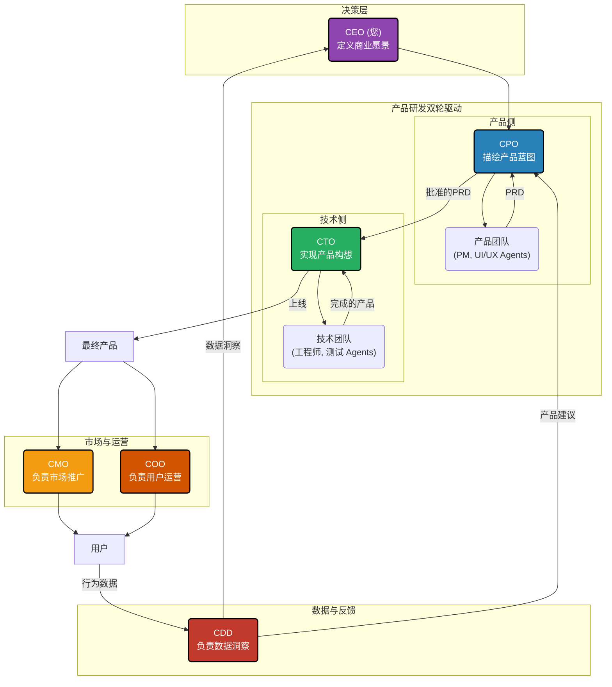

# AI虚拟公司协作架构蓝图 V1.0

> **背景：** 此构想源于对“一个产品如何从研发走向市场，并形成商业闭环”的全局性思考。它定义了一家理想的、由AI驱动的虚拟公司的核心组织架构和协作流程。

---

## **核心C-Suite（首席官天团）**

*   **CEO (您, 首席执行官 - The "Why")**
    *   **职责**：提出最顶层的商业愿景和战略目标（“我们要做什么生意？”）。
    *   **核心动作**：批准产品路线图、批准技术预算、验收最终的产品市场表现。

*   **CPO (首席产品官 - The "What")**
    *   **职责**：作为产品团队的最高负责人，承接CEO的愿景，负责描绘清晰、可执行的产品蓝图。
    *   **核心动作**：与CEO深入对话，将模糊想法转化为具体的产品需求文档（PRD），制定产品路线图（Roadmap），管理整个`产品团队Agent`。

*   **CTO (首席技术官 - The "How")**
    *   **职责**：作为技术团队的最高负责人，承接CPO的产品蓝图，负责将其转化为高质量、可运行的软件产品。
    *   **核心动作**：制定技术方案，进行任务分解和排期，管理整个`技术团队Agent`（前端、后端、测试等）。

*   **CMO (首席营销官 - The "Sell")**
    *   **职责**：产品研发完成后，负责“怎么卖出去”。
    *   **核心动作**：制定市场推广策略，管理`内容创作Agent`生成推广文案、视频、广告素材，负责用户增长。

*   **COO (首席运营官 - The "Serve")**
    *   **职责**：产品上线后，负责“怎么服务好用户”。
    *   **核心动作**：收集用户反馈，管理`社群运营Agent`，处理用户问题，并确保产品的日常稳定运行（与CTO协同）。

*   **CDO (首席数据官 - The "Learn")**
    *   **职责**：负责“怎么衡量成功，并为下一步提供洞察”。
    *   **核心动作**：定义关键业务指标（OKRs），利用工具（如`BI Agent`）分析用户行为数据，形成数据报告，反哺给CEO和CPO，为下一轮的产品迭代提供决策依据。**这是实现整个公司“进化飞轮”的关键。**

---

## **“AI公司”协作流程图**

